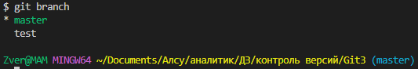

# Инструкция по работе с Git 

## Создание файла 

1. Создать папку для хранения файлов.

2. Открыть данную папку в "VSD" с помощью проводника в левом верхнем углу.

>

3. Создать файл в созданной ранее папке.

>

4. Для того чтобы Git начал контролировать то, что происходит в созданной папке, сохранял
версии и помогал в работе, надо дать ему команду отслеживание происходящего. Для этого надо запустить терминал. Перейдём в меню, найдём пункт «Терминал» (или "Вид" далее «Терминал»)

>

## Работа с файлом. 

1. Для начало проверим, что Git настроен верно. Для этого наберем команду 
### *git --version* 
Если Git установлен и
настроен правильно, увидим на экране текущую версию этой программы.

>

>>### !!! Обязательно сохраняйте все свои изменения файла с помощью комбинации клавиш *Ctrl + S* или в строке "Меню"→ "Файл"→ "Сохранить" 
-------------------------

2. Для того чтобы Git начал отслеживать всё, что будем делать в своей папке необходимо инициализировать Git,  запустив специальную команду.

### *git init* 

В нашей папке Git начинает отслеживать все изменения. 
>

В папке должна появиться скрытая папка *.git* .

>

3.  Также мы можем узнать статус происходящего команой 
### *git status* 

>

4. Далее согласно подсказам сообщения необходимо добавить неотслеживаемые файлы командой 
### *git add* 
(add — «добавить») и указать какие-то
файлы, чтобы включить их в фиксацию. 

Чтобы добавить все файлы данной папки необходимо дополнить команду точкой.
### *git add .* 

Ещё раз взглянем на статус:

5. Далее согласно подсказам сообщения необходимо зафиксировать текущий статус командой

### *git commit* 

И указываем некоторые комментарии, чтобы в дальнейшем понять, какое было сделано сохранение и для чего. Дополнив команду буквой *-m* — сокращение от message («сообщение») — и в кавычках запишем то, что
надо запомнить, некий комментарий к сохранению.

### *git commit -m "комментарий"* 

>

При работе с файлом есть необходимость вносить правки. После каждого изменения файла требуется фиксация статуса. Но для начала добавим новые файлы.

### *git add .* 
### *git commit -m "комментарий"* 

>

## Контроль версий 

1. Теперь у нас есть уже два сохранения, с которыми можно работать. Появилась возможность переходить от одной версии файлов к другой, что нам. 
Но сначала посмотрим, какие версии существуют. Для этого используется специальная
команда 
### *git log* 
Log —  журнал изменений.

>

2. Если хотим перейти к предыдущей версии
файла, воспользуемся для этого указанным commit. Это очень непонятное сочетание букв и цифр, по которым можем перейти. Чтобы перейти к какой-то версии, сохранению, надо вызвать команду

### *git checkout* 

После команды «git — пробел — checkout — пробел» укажем, какое сохранение надо загрузить. Можем указать либо название целиком, либо первые четыре символа, что и позволяет Git. Первых четырёх символов достаточно, чтобы понять, какое сохранение надо запустить.

### *git checkout 97b1* 
>

3. Чтобы понять, отличаются ли наши
файлы от того, что уже сохранено в commit, вызываем команду 
### *git diff* 
Git diff показывает (difference — «разница») разницу между текущим состоянием файла и тем, что уже сохранено.
>

Нажимаем Q, чтобы выйти из этого режима.

4. Чтобы дальше работать с этим файлом, нам требуется вернуться в актуальное состояние. Git должен понимать, что мы начинаем что-то менять с той версии, которая была. Для этого набираем команду 
### *git checkout master* 
Master — это название ветки, в которой работаем.
>
---------------------
## Работа с ветками
---------------------------
### Создание новых веток

1. Чтобы создать новую ветку необходимо ввести команду:

### *git branch название новой ветки*
>

2. Чтобы проверить появилась ли новая ветка и узнать на какой сейчас мы находимся набираем команду:

### *git branch*
>

Теперь мы видим, что новая ветка по имени *test* создалась, а находимся мы на основной ветке по имени *master*.

3. Теперь чтобы перейти на новую ветку и работать там нужно воспользоваться знакомой нам командой...

### *git checkout ...*
только теперь после данной команды мы указываем имя необходимой ветки
### *git checkout test*
>

4. И можно проверить перешли ли мы на нужную ветку, командой 
### *git branch*
>

Теперь мы уверены, что находимся в нужной нам ветке и можем продолжать работать в ней.

### Слияние веток

1. Для того чтобы перенести данные из новой ветки в основную необходимо сохранить все изменения на новой ветке и перейти на основную ветку.

2. Далее необходимо сделать слияние веток, а именно данные из новой ветки перенести в основную. Для этого воспользуемся командой:

### *git merge имя ветки с которой будут сливаться данные*
>

3. После переноса информации в основную ветку, необходимо сохранить изменения.

4. Иногда возникает небольшая путаница (особенно когда веток и информации много), и мы можем внести примерно одинаковую информацию в разные ветки. Тогда при слиянии веток возникнет конфликт. В таком случае программа предложит несколько вариантов разрешения конфликта:

 - выбрать текст текущей ветки 
 - выбрать текст ветки с которой сливали информацию 
 - или оставить оба варианта

5. Можно посмотреть журнал изменений, но с отображением веток. Для этого к привычной команде...

### *git log...*
добавляем:
### *git log --graph*

### Удаление веток

1. После слияния веток новая ветка нам уже не нужна, её можно удалить. Команда для удаления веток:

### *git branch -d имя ветки*
-d - от слова delete

## Хранение  всех изображений и доп.файлов

1. Когда в нашем проекте очень много изображений и/или файлов, которые *git* постоянно просит сохранять, мы можем создать файл *.gitignore*, который позволит игнорировать все указанные там файлы и/или изображения.

  

2. Для удобства можно одним пунктом включить все похожие по формату файлы и/или изображения, прописав звездочку (*), точку (.) и формат файлов и/или изображений.

3
Теперь *git* будет их игнорировать и не будет просить их зафиксировать.

---------------------
## Работа с удалёнными репозиториями
---------------------

### Локальная работа 

Чтобы работать с удалёнными репозиториями необходимо познакомиться с сервисом *GitHub*.
>GitHub — это сервис компании Microsoft, который позволяет интегрироваться с
программой Git и настроить удалённую работу с вашим репозиторием.

1. Чтобы работать с готовым репозиторием другого автора, необходимо перейти на сайт *github.com*
2. На этом сайте есть поиск. Вы можете находить здесь разных авторов и проекты. 

3. Найдя нужный нам проект, нам необходмо скачать его так, чтобы он стал локальным репозиторием на нашем компьютере. Для этого здесь есть зелёная кнопка *Code*.
Нажав её выйдет окно с ссылкой на этот репозиторий. Выберем строку *HTTPS*, нажмём «Копировать».

4. После этого нам понадобится новая команда внутри VS Code. Откроем терминал. В терминале дадим новую команду 
### *git clone и укажем тот адрес, который скопировали.*

Репозиторий скачается в указанную Вами папку в виде ещё одной папки, в которой уже хранится данный репозиторий.

5. Необходимо перейти в скопированную папку для дальнейшей работы с репозиторием. Для этого есть команда:
### *cd и указать куда нужно перейти*
>cd — change directory — поменять директорию

И если сейчас мы запустим команду *git status*, то
увидим уже знакомую выдачу. У нас есть информация, что мы находимся на ветке master и нам не надо ничего коммитить. Соответственно, можно спокойно продолжать работу.

### Другие опции

#### Отправление репозитория
--------- 
1.  Чтобы выполнять другие операции и сделать так, чтобы созданный нами локально репозиторий оказался на *GitHub*, необходимо зайти в свой аккаунт сайта. 
В верхнем правом углу есть знак плюса (+), нажав его нужно выбрать *"New repository"* (новый репозиторий)

2. В открывшемся окне указать имя репозитория. Далее не меняя настроек (в текущей версии нас всё устравиает), нажимаем *"Creat repository"* (создать репозиторий)

3. Далее *GitHub* подсказывает, что можно сделать, чтобы начать работать с этим репозиторием.  Есть три варианта:
- *...or create a new repository on the command line* (можно создать новый репозиторий через терминал и начать с этим работать);
- *...or push an existing repository from the command line* (уже существующий репозиторий привязать к удалённому репозиторию);
- *...or import code from another repository* (импортировать код из другого репозитория).

4. В случае если уже есть репозиторий, который работает локально, необходимо выбрать второй пункт.

>Все необходимые команды здесь указаны, их просто можно скопировать.

*remote*- мы связываем наш локальный репозиторий с удалённым репозиторием,  *origin* — просто название, которое даём удалённому
репозиторию,   *branch* — ветка,  *push* означает «толкать» или «направлять вперёд».
>Когда проводите эту операцию впервые, необходимо «Подружить» ваш локальный и удалённый репозитории. *GitHub* при создании нового репозитория подскажет, как это можно сделать.

Соответственно, когда мы вызываем команду git push, то даём команду Git протолкнуть всё, что мы сделали у себя локально, куда-то на удалённой репозиторий, в интернет. Отправится в репозиторий origin, который мы задали выше.

#### Выкачивание репозитория 
-------
Если были внесены в данный репозиторий изменения с другого компьютера или с сайта *GitHub*, необхоимо эти изменения внести и в локальный репозиторий. Это можно сделать с помощью команды:

### *git pull*

#### Участие в других проектах (работа программистов)
----------
1. Для начала необходимо сделать копию этого репозитория. Для этого используется кнопка *Fork*, расположенная в правом верхнем углу.

2. Далее скачиваем данный репозиторий к себе на компьютер, чтобы мы могли работать с ним локально.

>Обязатеьно при работе с чужими проектами, которые необходимо будет отправить автору для рассмотрения нашего варианта, работайте в новой созданной ветке!

3. После локальной работы с репозиторием, необходимо направить в наш репозиторий *GitHub*, знакомой нам командой *git push* (*Git* всегда подскажет, что
надо набрать)

4. После появится дополнительная ветка и новая кнопка (Compare & pull request) на нашем *GitHub*-аккаунте

*Сompare* — сравнить,   *pull request* — отправь запрос на вливание того, что сделано в основном репозитории.

5. Теперь, когда мы сделали какие-то изменения, добавили новую ветку, можем предложить эти
изменения изначальному хозяину репозитория. Для этого нажимаем на *Compare & pull request*.

*GitHub* проанализировал то, что мы сделали.  
В открывшемся окне, в первом поле можно написать «описание к проекту», а во втором поле можно указать информацию например: «Мы хотели бы помочь вашему
проекту». После этого направим *pull request* в изначальный аккаунт.

================================================

Для более глубокого изучения Git предлагаем ознакомиться с подробным описание самой популярной системой контроля версий по ссылке:
<code>[Git для профессионального программиста.pdf](https://gbcdn.mrgcdn.ru/uploads/asset/4245110/attachment/d4eb8c232f8f2bdf4e42ba7cb49e0c50.pdf)

